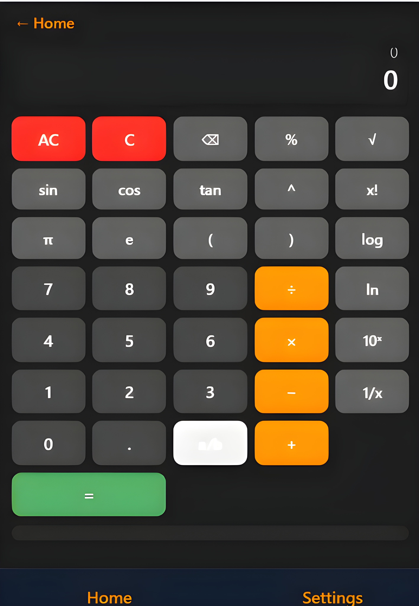
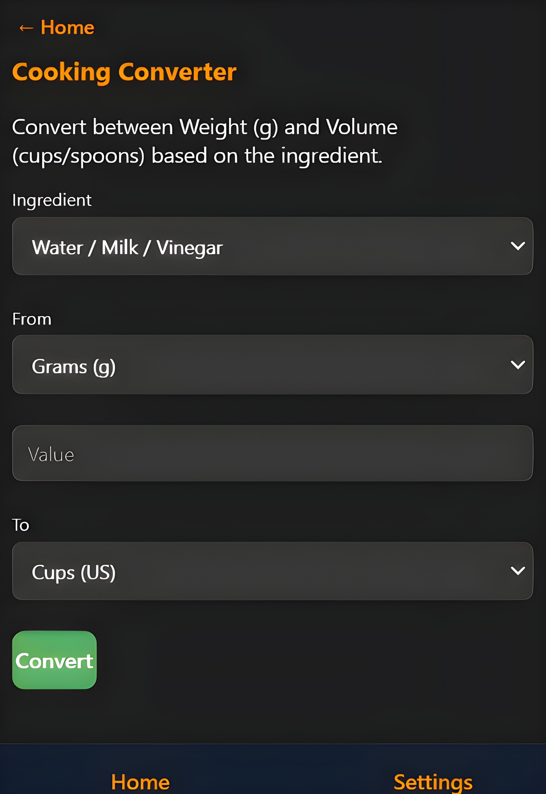

### Home Screen

The home screen of the Calculator Collection app, showing various calculator options.

### Fuel Cost Calculator

The Fuel Cost Calculator for estimating trip expenses.

### Scientific Calculator

The Scientific Calculator with advanced functions.

### Cooking Converter

The Cooking Converter for converting between weight and volume.

### Settings Screen

The settings screen of the Calculator Collection app, showing options for Light Mode, Remember History, and Clear All History.


# Calculator Collection

A comprehensive web-based collection of calculators for everyday use, including basic arithmetic, scientific calculations, cooking conversions, financial tools, and more.
---

## Table of Contents
- [Introduction](#introduction)
- [Features](#features)
- [Usage](#usage)
- [Installation](#installation)
- [Technologies Used](#technologies-used)
- [Contributing](#contributing)
- [License](#license)
- [Contact](#contact)

---

## Introduction

The Calculator Collection is a versatile web application designed to provide a wide rangeOf calculators in one place. Whether you need to perform basic arithmetic, scientific calculations, cooking conversions, or financial computations, this app has you covered.

---

## Features

### Basic Calculator
- Perform basic arithmetic operations: addition, subtraction, multiplication, and division.
- Additional functions: percentage, square root, and reciprocal.

### Scientific Calculator
- Advanced mathematical functions: sine, cosine, tangent, logarithms, exponents, and factorials.
- Constants: π (pi) and e (Euler's number).

### Cooking Converter
- Convert between weight (grams, kilograms) and volume (cups, tablespoons, teaspoons) for various cooking ingredients.

### Financial Calculators
- **Sales Tax Calculator**: Calculate the tax amount and total price.
- **Loan Calculator**: Determine monthly payments, total payments, and total interest for loans.
- **Savings Calculator**: Calculate future value, total contributions, and total interest for savings plans.

### Fuel Calculators
- **Fuel Cost Calculator**: Calculate the cost of fuel for a trip.
- **Fuel Efficiency Calculator**: Determine fuel efficiency in miles per gallon (MPG) or liters per 100 kilometers (L/100km).

### Academic Tools
- **GPA Calculator**: Calculate your Grade Point Average (GPA) based on your courses and grades.

### Health and Wellness
- **Ovulation Calculator**: Calculate ovulation dates and fertile windows.

### Unit Converter
- Convert between different units of length (meters, feet, inches, kilometers, miles) and weight (kilograms, pounds).

### Hexadecimal Calculator
- Perform arithmetic operations in hexadecimal format and convert between hexadecimal, decimal, binary, and octal.

---

## Usage

### Online Usage
1. Visit the live demo: [Calculator Collection](https://bestis1.github.io/Calculator-Collection/)
2. Choose a calculator from the home screen.
3. Input the required values and perform your calculations.

### Local Usage
1. Clone the repository:
   ```bash
   git clone https://github.com/bestis1/Calculator-Collection.git

For questions, suggestions, or issues, please contact us at:

2. Open the index.html file in your preferred web browser.

## Installation
No installation is required for the online version. For local usage, simply clone the repository and open the index.html file in your browser.

## Technologies Used

HTML5: Structure of the web application.
CSS3: Styling and layout.
JavaScript: Functionality and interactivity.
GitHub Pages: Hosting the live demo.

## Contributing
We welcome contributions to improve the Calculator Collection. Here's how you can contribute:

Fork the Repository: Create your own fork of the code.
Clone the Fork: Clone your fork to your local machine.
Create a Branch: Create a new branch for your feature or bug fix.
Make Changes: Implement your changes.
Commit Changes: Commit your changes with a descriptive message.
Push Changes: Push your changes to your fork.
Create a Pull Request: Submit a pull request to the main repository.
Please ensure your code adheres to the existing style and includes appropriate comments.

## License
This project is licensed under the MIT License. See the LICENSE file for more details.

## Contact
For questions, suggestions, or issues, please contact us at:

Email: contact@bestis1.com
GitHub: bestis1

